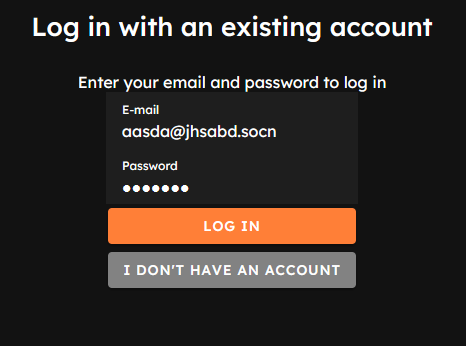
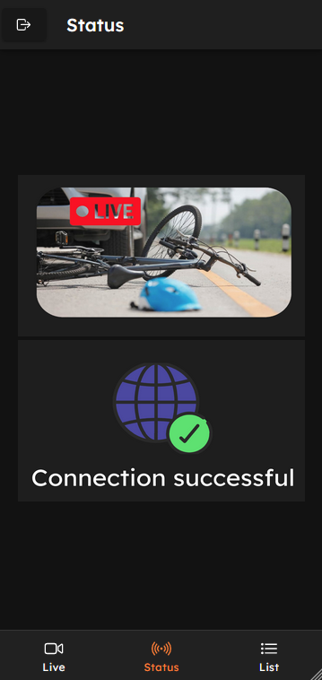

# Proyecto "Ojos de Carlos"

[![css3-badge-sm]][css3-web] [![figma-badge-sm]][figma-web] [![git-badge-sm]][git-web] [![github-badge-sm]][github-web] [![html5-badge-sm]][html5-web] [![ionic-badge-sm]][ionic-web] [![js-badge-sm]][js-web] [![mysql-badge-sm]][mysql-web] [![nodejs-badge-sm]][nodejs-web] [![npm-badge-sm]][npm-web] [![vscode-badge-sm]][vscode-web]

[![ios-development-badge-sm]][ios-development-web] [![android-development-badge-sm]][android-development-web]

## Integrantes

- Bryam Gonzalez Mendez
- Alejandro Malvacias Pimentel
- Pablo Paillalef Avendaño
- Benjamín Vega Mardones

## Descripción

La aplicación es un software que permite conectarse al robot "Carlos". La aplicación muestra la lista de víctimas que Carlos encuentra en su camino, el estado de Carlos, y permite ver lo que Carlos está viendo mientras explora.

## Entrega Parcial 2

### EP2.2
En la aplicación se hace lectura de archivos JSON en dos ocaciones: La primera en la página Tab3 donde se lee una lista de víctimas, la segunda en la página Signup-page donde se hace lectura de las regiones y comunas.

### EP2.3
[Modelo de la base de datos](recursos entrega/diagrama_db.png)

### EP2.4

En estas dos imágenes se ocupa la Humanización de mensajes, Lenguaje simple y la facilización de la navegación por el uso de colores. 

Aquí se ocupa la tab bar y el flat design.

[js-badge-sm]: https://img.shields.io/badge/JavaScript-F7DF1E?logo=javascript&logoColor=000&style=flat
[js-web]: https://developer.mozilla.org/es/docs/Web/JavaScript
[ts-badge-sm]: https://img.shields.io/badge/TypeScript-3178C6?logo=typescript&logoColor=fff&style=flat
[ts-web]: https://www.typescriptlang.org/
[html5-badge-sm]: https://img.shields.io/badge/HTML5-E34F26?logo=html5&logoColor=fff&style=flat
[html5-web]: https://developer.mozilla.org/es/docs/Web/HTML
[css3-badge-sm]: https://img.shields.io/badge/CSS3-1572B6?logo=css3&logoColor=fff&style=flat
[css3-web]: https://developer.mozilla.org/es/docs/Web/CSS
[tailwind-badge-sm]: https://img.shields.io/badge/Tailwind_CSS-38B2AC?logo=tailwind-css&logoColor=fff&style=flat
[tailwind-web]: https://tailwindcss.com/
[react-badge-sm]: https://img.shields.io/badge/React-61DAFB?logo=react&logoColor=fff&style=flat
[react-web]: https://reactjs.org/
[angular-badge-sm]: https://img.shields.io/badge/Angular-DD0031?logo=angular&logoColor=fff&style=flat
[angular-web]: https://angular.io/
[nodejs-badge-sm]: https://img.shields.io/badge/Node.js-339933?logo=node.js&logoColor=fff&style=flat
[nodejs-web]: https://nodejs.org/
[express-badge-sm]: https://img.shields.io/badge/Express.js-000000?logo=express&logoColor=fff&style=flat
[express-web]: https://expressjs.com/
[mongodb-badge-sm]: https://img.shields.io/badge/MongoDB-47A248?logo=mongodb&logoColor=fff&style=flat
[mongodb-web]: https://www.mongodb.com/
[postgresql-badge-sm]: https://img.shields.io/badge/PostgreSQL-336791?logo=postgresql&logoColor=fff&style=flat
[postgresql-web]: https://www.postgresql.org/
[mysql-badge-sm]: https://img.shields.io/badge/MySQL-4479A1?logo=mysql&logoColor=fff&style=flat
[mysql-web]: https://www.mysql.com/
[git-badge-sm]: https://img.shields.io/badge/Git-F05032?logo=git&logoColor=fff&style=flat
[git-web]: https://git-scm.com/
[github-badge-sm]: https://img.shields.io/badge/GitHub-181717?logo=github&logoColor=fff&style=flat
[github-web]: https://github.com
[npm-badge-sm]: https://img.shields.io/badge/npm-CB3837?logo=npm&logoColor=fff&style=flat
[npm-web]: https://www.npmjs.com/
[yarn-badge-sm]: https://img.shields.io/badge/Yarn-2C8EBB?logo=yarn&logoColor=fff&style=flat
[yarn-web]: https://yarnpkg.com/
[prettier-badge-sm]: https://img.shields.io/badge/Prettier-F7B93E?logo=prettier&logoColor=fff&style=flat
[prettier-web]: https://prettier.io/
[eslint-badge-sm]: https://img.shields.io/badge/ESLint-4B32C3?logo=eslint&logoColor=fff&style=flat
[eslint-web]: https://eslint.org/
[vscode-badge-sm]: https://img.shields.io/badge/Visual_Studio_Code-007ACC?logo=visual-studio-code&logoColor=fff&style=flat
[vscode-web]: https://code.visualstudio.com/
[ionic-badge-sm]: https://img.shields.io/badge/Ionic-3880FF?logo=ionic&logoColor=fff&style=flat
[ionic-web]: https://ionicframework.com/
[figma-badge-sm]: https://img.shields.io/badge/Figma-F24E1E?logo=figma&logoColor=fff&style=flat
[figma-web]: https://www.figma.com/
[ios-development-badge-sm]: https://img.shields.io/badge/iOS_Development-000000?logo=ios&logoColor=fff&style=flat
[ios-development-web]: https://developer.apple.com/ios/
[android-development-badge-sm]: https://img.shields.io/badge/Android_Development-3DDC84?logo=android&logoColor=fff&style=flat
[android-development-web]: https://developer.android.com/

[figma-prot-badge]: https://img.shields.io/badge/Ver%20prototipo%20en%20Figma-F24E1E?logo=figma&logoColor=fff&style=flat
[figma-prot-url]: https://www.figma.com/proto/QaKiq61umExCzpWQDkRnlv/Maqueta-UI?type=design&t=GG4iBq3RFbpwbZLF-0&scaling=scale-down&page-id=0%3A1&node-id=74-529&starting-point-node-id=74%3A529
[figma-dis-badge]: https://img.shields.io/badge/Ver%20diseño%20UI%20en%20Figma-F24E1E?logo=figma&logoColor=fff&style=flat
[figma-dis-url]: https://www.figma.com/file/QaKiq61umExCzpWQDkRnlv/Maqueta-UI?type=design&node-id=0-1&mode=design&t=nlpD4y9IjTlzBTYb-0
